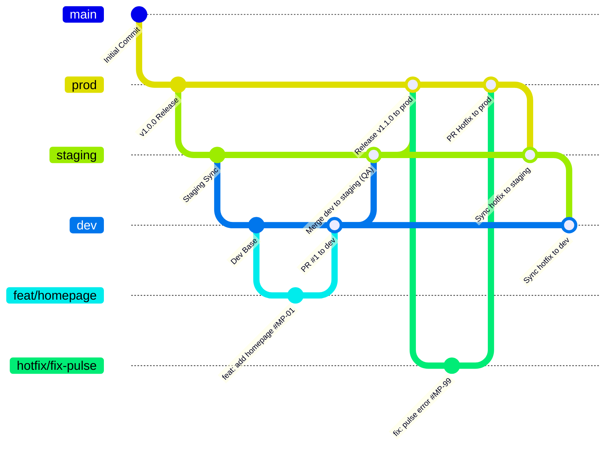

# Quy Trình Gitflow Workflow Chuẩn Dự Án MeridianPulse

Thư mục này chuẩn hóa toàn bộ quy trình làm việc với Git, cấu trúc phân phối nhánh, quy chuẩn commit message bắt buộc đi kèm Issue ID, và quy trình xử lý lỗi khẩn cấp (Hotfix 3 chiều).

---

## 📑 Danh Mục Tài Liệu Gitflow

| Tài Liệu | Nội Dung Chính |
| :--- | :--- |
| [branching-strategy.md](branching-strategy.md) | Cấu trúc 3 nhánh chính (`prod`, `staging`, `dev`) và 2 nhóm nhánh hỗ trợ (`feat/*`, `hotfix/*`), vòng đời nhánh và quy tắc merge. |
| [commit-convention.md](commit-convention.md) | Quy chuẩn Conventional Commits bắt buộc đi kèm mã **Issue ID** (`#MP-xx`), các loại type hợp lệ và Git Hook kiểm tra tự động. |
| [hotfix-and-sync-process.md](hotfix-and-sync-process.md) | Quy trình cô lập và sửa lỗi khẩn cấp từ `prod`, mở PR khẩn cấp và bắt buộc đồng bộ 3 chiều (`prod` ➔ `staging` ➔ `dev`). |
| [branch-protection-and-review.md](branch-protection-and-review.md) | Hướng dẫn cấu hình khóa nhánh trên GitHub, chống push trực tiếp vào `prod`/`staging`, và checklist Code Review. |

---

## 🧭 Sơ Đồ Tổng Quan Luồng Phân Nhánh



---

## ⚡ Bảng Tra Cứu Lệnh Git Thường Dùng

```bash
# Cập nhật mã nguồn mới nhất
git switch dev
git pull origin dev

# Tạo nhánh tính năng mới từ dev
git switch -c feat/MP-01-homepage-dashboard

# Commit code bắt buộc có mã Issue ID
git add .
git commit -m "feat: add real-time ecg pulse monitor #MP-01"

# Đẩy nhánh lên remote để mở Pull Request
git push -u origin feat/MP-01-homepage-dashboard
```
