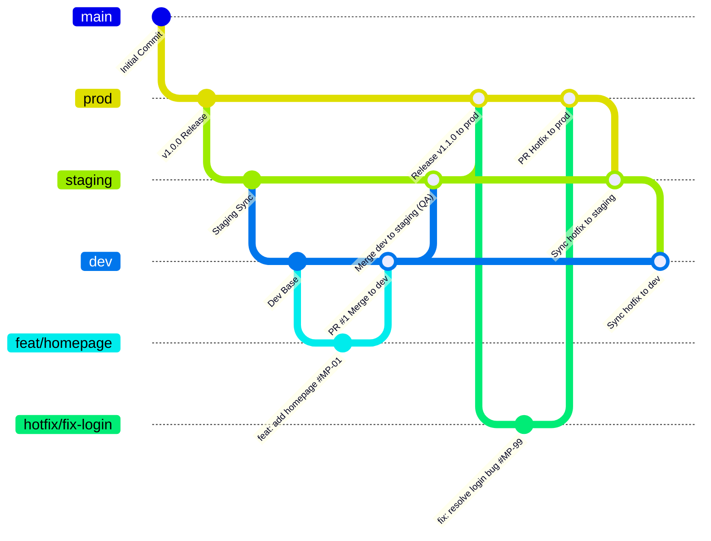

# Quy Trình Gitflow Workflow Chuẩn Dự Án MeridianPulse

Tài liệu này định nghĩa cấu trúc phân phối nhánh, quy ước commit message đi kèm Issue ID, và quy trình làm việc phối hợp (Feature, Pull Request, Release, Hotfix) cho toàn bộ thành viên trong dự án **MeridianPulse**.

---

## 1. Cấu Trúc Nhánh Chính & Vai Trò

Dự án áp dụng mô hình **Gitflow** chuẩn hóa với 3 nhánh vĩnh viễn (Long-lived branches) và 2 nhóm nhánh hỗ trợ theo nhiệm vụ (Temporary/Task branches):



### 1.1. Ba nhánh chính vĩnh viễn (Main Branches)

| Tên Nhánh | Môi Trường Triển Khai | Mục Đích & Quyền Hạn | Cơ Chế Cập Nhật |
| :--- | :--- | :--- | :--- |
| **`prod`** | Production (Khách hàng cuối) | Chứa mã nguồn thực thi chính thức. Độ ổn định tuyệt đối (99.99%). Bị khóa push trực tiếp. | Chỉ nhận merge từ **`staging`** (khi hoàn thành UAT) hoặc từ **`hotfix/*`** (khi có sự cố khẩn cấp). Cần tối thiểu 2 approvals. |
| **`staging`** | Staging / Pre-Production / QA | Môi trường kiểm thử chất lượng, test tích hợp, demo cho Product Owner / Khách hàng duyệt. | Nhận merge từ **`dev`** sau khi các tính năng của Sprint đã sẵn sàng đóng gói kiểm thử, hoặc nhận sync từ **`prod`** sau hotfix. |
| **`dev`** | Development / Sandbox | Không gian làm việc chung của Developer. Nơi tổng hợp mã nguồn của tất cả tính năng trong Sprint. | Chỉ nhận mã nguồn thông qua **Pull Request (PR)** từ các nhánh `feat/*`. Nghiêm cấm push trực tiếp. |

### 1.2. Các nhánh hỗ trợ tạm thời (Temporary Branches)

| Nhánh | Nhánh Gốc (Base) | Nhánh Đích (Merge Into) | Định Dạng Tên | Vòng Đời |
| :--- | :--- | :--- | :--- | :--- |
| **Feature** | `dev` | `dev` | `feat/<issue_id>-<feature_name>` hoặc `feat/<feature_name>`<br>*Ví dụ:* `feat/MP-01-homepage`, `feat/login_page` | Xóa nhánh remote sau khi merge thành công vào `dev`. |
| **Hotfix** | `prod` | `prod` (rồi sync `staging`, `dev`) | `hotfix/<issue_id>-<hotfix_name>` hoặc `hotfix/<hotfix_name>`<br>*Ví dụ:* `hotfix/MP-99-fix_login_error` | Xóa nhánh remote sau khi đã merge vào `prod` và đồng bộ xong. |

---

## 2. Quy Chuẩn Commit Message (Đi Kèm Issue ID)

Mọi commit được đẩy lên repository **bắt buộc phải tuân thủ chuẩn Conventional Commits và có mã Issue ID** để tự động liên kết với hệ thống Scrum/Jira/GitHub Issues.

### 2.1. Cú pháp bắt buộc

```text
<type>(<scope>): <mô tả ngắn gọn bằng thể chủ động> #<id_issue>

[Tùy chọn: Body - Mô tả chi tiết lý do và giải pháp kỹ thuật]

[Tùy chọn: Footer - BREAKING CHANGE hoặc Tham chiếu chéo]
```

### 2.2. Danh sách các `<type>` hợp lệ

- `feat`: Thêm một tính năng mới cho người dùng.
- `fix`: Sửa lỗi (bug) trong hệ thống.
- `hotfix`: Sửa lỗi khẩn cấp đang xảy ra trên môi trường Production.
- `docs`: Bổ sung hoặc chỉnh sửa tài liệu kỹ thuật, README, Swagger.
- `style`: Định dạng code (khoảng trắng, dấu chấm phẩy, format) không ảnh hưởng logic.
- `refactor`: Tái cấu trúc code (không sửa bug cũng không thêm tính năng mới).
- `test`: Bổ sung hoặc cập nhật unit test, integration test.
- `chore`: Cấu hình build, dependencies, CI/CD pipeline, npm scripts.

### 2.3. Ví dụ thực tế trong dự án

- ✅ **Hợp lệ:**
  - `feat: add homepage dashboard layout #MP-01`
  - `feat(auth): implement jwt refresh token logic #MP-04`
  - `fix: resolve login bug #MP-102`
  - `hotfix: resolve live telemetry pulse disconnection #MP-99`
  - `docs: update scrum sprint backlog #MP-00`
- ❌ **Không hợp lệ:**
  - `fix bug` *(Không có type hợp lệ, không có issue ID, mô tả vô nghĩa)*
  - `update code #12` *(Mô tả không nói rõ làm việc gì)*
  - `feat: add login page` *(Thiếu mã Issue ID)*

---

## 3. Bảng Tra Cứu Các Lệnh Git Cơ Bản & Thường Dùng

```bash
# 1. Khởi tạo & Clone
git init                                     # Khởi tạo repo cục bộ
git clone <url_repo>                         # Clone repo từ remote về máy

# 2. Làm việc hàng ngày
git status                                   # Kiểm tra trạng thái file (untracked, modified, staged)
git add <file>                               # Đưa file vào staging area (hoặc git add . để add tất cả)
git commit -m "feat: add homepage #MP-01"    # Ghi nhận commit kèm message đúng chuẩn
git pull origin <branch_name>                # Kéo cập nhật mới nhất từ remote về local

# 3. Quản lý nhánh
git branch                                   # Liệt kê các nhánh local (* là nhánh hiện tại)
git branch -a                                # Liệt kê cả nhánh local và remote
git checkout -b feat/homepage dev            # Tạo nhánh mới feat/homepage từ nhánh dev
git switch -c feat/homepage                  # Cú pháp hiện đại tạo và chuyển nhánh
git switch dev                               # Chuyển về nhánh dev
git branch -d feat/homepage                  # Xóa nhánh local sau khi đã merge xong
git push origin --delete feat/homepage       # Xóa nhánh trên remote

# 4. Đẩy mã nguồn & Tích hợp
git push origin <branch_name>                # Đẩy commit lên remote repository
git merge <branch_name>                      # Hợp nhất nhánh vào nhánh hiện tại
```

---

## 4. Quy Trình Làm Việc Tính Năng (Feature Workflow)

### Bước 1: Nhận Task & Tạo Nhánh Tính Năng
1. Kiểm tra Issue ID trên Scrum Board (Ví dụ: `#MP-01 - Xây dựng Homepage Dashboard`).
2. Cập nhật nhánh `dev` mới nhất:
   ```bash
   git switch dev
   git pull origin dev
   ```
3. Tạo nhánh tính năng mới từ `dev`:
   ```bash
   git switch -c feat/MP-01-homepage
   ```

### Bước 2: Lập trình và Commit Code
1. Viết code, bổ sung unit test.
2. Kiểm tra trạng thái và stage file:
   ```bash
   git status
   git add fe/index.html docs/
   ```
3. Commit kèm Issue ID:
   ```bash
   git commit -m "feat: add homepage dashboard layout #MP-01"
   ```

### Bước 3: Đẩy Code và Mở Pull Request (PR)
1. Đẩy nhánh lên GitHub:
   ```bash
   git push -u origin feat/MP-01-homepage
   ```
2. Truy cập GitHub, tạo **Pull Request**:
   - **Base branch:** `dev`
   - **Compare branch:** `feat/MP-01-homepage`
   - **Tiêu đề PR:** `[#MP-01] Xây dựng Homepage Dashboard cho MeridianPulse`
   - Điền đầy đủ PR Template (mô tả, checklist, tự động đóng issue bằng cú pháp `Closes #MP-01`).

### Bước 4: Review Code & Merge
1. Yêu cầu ít nhất 1 Tech Lead hoặc Peer Reviewer duyệt (Approve).
2. Khi CI/CD kiểm tra (Lint, Unit Test) màu xanh (Pass), chọn **Squash and Merge** hoặc **Create a Merge Commit** vào `dev`.
3. Xóa nhánh feature trên remote GitHub và local.

---

## 5. Quy Trình Chuyển Giao Môi Trường (Promotion: dev -> staging -> prod)

```text
[feat/*] ---> (PR) ---> [dev] ---> (Testing & Sprint Done) ---> [staging] ---> (UAT & Demo OK) ---> [prod]
```

### 5.1. Chuyển từ `dev` sang `staging` (Cuối Sprint hoặc Khi Cần Test QA)
1. Developer / Release Engineer kiểm tra `dev` đã pass toàn bộ tests.
2. Mở PR từ `dev` vào `staging`:
   - Tiêu đề: `Release Candidate: Sprint 01 Build #RC-01`
3. Merge `dev` vào `staging`.
4. Môi trường Staging tự động kích hoạt deploy pipeline phục vụ QA/QC và UAT.

### 5.2. Chuyển từ `staging` sang `prod` (Triển khai Production)
1. Sau khi đội QA/QC và Product Owner nghiệm thu thành công trên `staging`.
2. Tạo PR từ `staging` vào `prod`.
3. Được sự phê duyệt của Product Owner và Lead Engineer.
4. Merge vào `prod`, đồng thời tạo Git Tag để đánh dấu phiên bản:
   ```bash
   git switch prod
   git pull origin prod
   git tag -a v1.0.0 -m "Release version 1.0.0: MeridianPulse core dashboard"
   git push origin v1.0.0
   ```

---

## 6. Quy Trình Xử Lý Sự Cố Khẩn Cấp (Hotfix Workflow)

Khi phát sinh lỗi nghiêm trọng trên Production (ảnh hưởng trực tiếp người dùng, rò rỉ dữ liệu, gián đoạn telemetry nhịp tim):

```text
               +--------------------------------------------------------+
               |                       [prod]                           |
               +---------------------------+----------------------------+
                                           | (Nhánh khẩn cấp)
                                           v
                             +---------------------------+
                             | hotfix/fix_pulse_stream   | (Sửa lỗi & Test)
                             +-------------+-------------+
                                           |
                   +-----------------------+-----------------------+
                   | (PR & Merge)          | (Sync)                | (Sync)
                   v                       v                       v
               +-------+              +---------+              +-------+
               | prod  |              | staging |              |  dev  |
               +-------+              +---------+              +-------+
```

### Quy trình chi tiết từng bước:

1. **Tạo nhánh hotfix từ `prod`:**
   ```bash
   git switch prod
   git pull origin prod
   git switch -c hotfix/MP-99-fix-pulse-stream
   ```
2. **Sửa lỗi và kiểm tra nghiêm ngặt tại local:**
   - Tiến hành fix lỗi tối thiểu, hạn chế sửa lan man sang các module khác.
   - Commit với thông điệp:
     ```bash
     git commit -m "hotfix: resolve live telemetry pulse disconnection #MP-99"
     ```
3. **Mở PR vào `prod`:**
   - Push nhánh: `git push -u origin hotfix/MP-99-fix-pulse-stream`
   - Mở PR từ nhánh hotfix vào **`prod`**.
   - Review khẩn cấp (Emergency Review) và merge trực tiếp vào `prod`.
   - Đánh tag bản vá (ví dụ `v1.0.1`).
4. **Đồng bộ 3 chiều bắt buộc (3-Way Synchronization):**
   *Nguyên tắc sống còn:* Lỗi đã sửa trên `prod` phải được cập nhật ngay lập tức vào `staging` và `dev` để tránh việc đợt release tiếp theo ghi đè lại bug cũ!
   ```bash
   # Đồng bộ vào staging
   git switch staging
   git pull origin staging
   git merge prod -m "chore: sync hotfix #MP-99 from prod to staging"
   git push origin staging

   # Đồng bộ vào dev
   git switch dev
   git pull origin dev
   git merge staging -m "chore: sync hotfix #MP-99 from staging to dev"
   git push origin dev
   ```
5. **Dọn dẹp:** Xóa nhánh hotfix sau khi hoàn tất.
