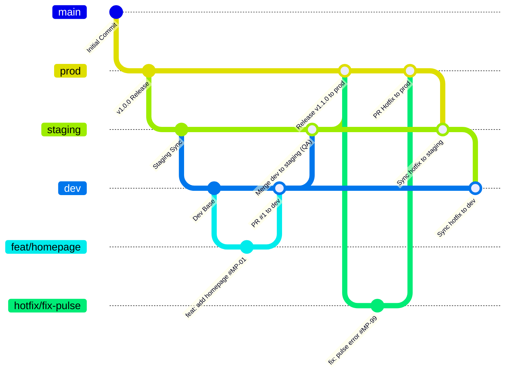

# Quy Trình Phân Phối Nhánh Gitflow (Gitflow Workflow)

---

## 1. Cấu Trúc 3 Nhánh Chính & Nhánh Hỗ Trợ



| Nhánh | Môi Trường | Mục Đích & Quyền Hạn | Cơ Chế Cập Nhật |
| :--- | :--- | :--- | :--- |
| **`prod`** | Production | Chứa code chạy thực tế cho người dùng cuối. Ổn định tuyệt đối (99.99%). Khóa push trực tiếp. | Chỉ nhận merge từ **`staging`** (khi UAT hoàn thành) hoặc từ **`hotfix/*`** (khi có sự cố khẩn cấp). Cần tối thiểu 2 approvals. |
| **`staging`** | Staging / QA | Môi trường kiểm thử chất lượng, test tích hợp và demo cho PO. | Nhận merge từ **`dev`** sau khi tính năng Sprint hoàn thành, hoặc nhận sync từ **`prod`** sau hotfix. |
| **`dev`** | Development | Không gian tích hợp chung của Developer trong Sprint. | Chỉ nhận mã nguồn thông qua **Pull Request (PR)** từ các nhánh `feat/*`. Nghiêm cấm push trực tiếp. |

---

## 2. Quy Trình Làm Việc Với Nhánh Tính Năng (Feature Workflow)

1. Cập nhật nhánh `dev` mới nhất:
   ```bash
   git switch dev
   git pull origin dev
   ```
2. Tạo nhánh tính năng kèm mã Issue:
   ```bash
   git switch -c feat/MP-01-homepage-dashboard
   ```
3. Lập trình và commit có mã Issue ID:
   ```bash
   git commit -m "feat: add homepage dashboard #MP-01"
   ```
4. Đẩy code và mở PR vào `dev`:
   ```bash
   git push -u origin feat/MP-01-homepage-dashboard
   ```

---

## 3. Quy Trình Sửa Lỗi Khẩn Cấp & Đồng Bộ 3 Chiều (Hotfix Workflow)

1. **Rẽ nhánh từ `prod`:**
   ```bash
   git switch prod
   git pull origin prod
   git switch -c hotfix/MP-99-fix-pulse-stream
   ```
2. **Sửa lỗi và commit:**
   ```bash
   git commit -am "fix: resolve telemetry pulse alert threshold error #MP-99"
   ```
3. **Mở PR vào `prod`:** Merge khẩn cấp vào `prod` và đánh tag phiên bản vá lỗi (`v1.0.1`).
4. **Bắt buộc đồng bộ 3 chiều (3-Way Synchronization):**
   ```bash
   # Đồng bộ vào staging
   git switch staging
   git pull origin staging
   git merge prod -m "Merge branch 'prod' into staging (Sync hotfix #MP-99)"
   git push origin staging

   # Đồng bộ vào dev
   git switch dev
   git pull origin dev
   git merge staging -m "Merge branch 'staging' into dev (Sync hotfix #MP-99)"
   git push origin dev
   ```
