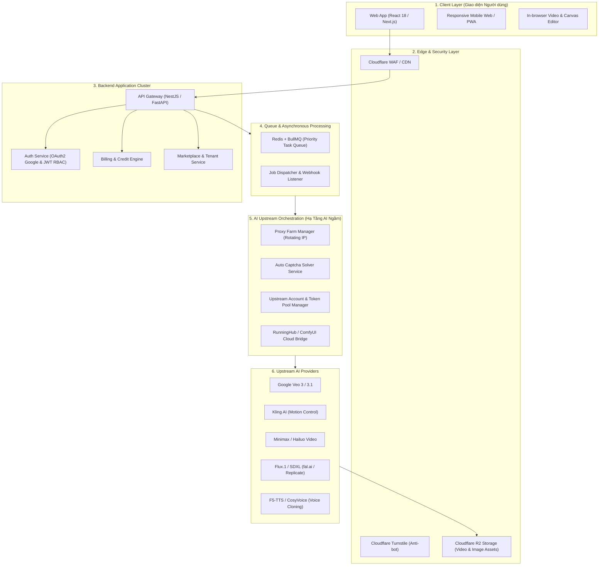

# Kiến Trúc Hệ Thống Nền Tảng AI Creator (System Architecture Blueprint)

Tài liệu này đặc tả toàn bộ kiến trúc hạ tầng kỹ thuật, mô hình tích hợp AI đa nhà cung cấp, cơ chế hàng đợi xử lý tác vụ nặng (Asynchronous Job Queue) và hệ thống vận hành ngầm (Proxy & Account Pool) để xây dựng nền tảng Generative AI Creator tương tự **PlenxAI**.

---

## 1. Sơ Đồ Kiến Trúc Tổng Thể (High-Level Architecture)



---

## 2. Ba Bài Toán Kỹ Thuật Cốt Tử (Core Engineering Challenges)

Để làm được một nền tảng như PlenxAI chạy ổn định 100%, bạn phải giải quyết được 3 bài toán sau:

### Bài toán 1: Tích hợp Upstream AI (Multi-Model AI Orchestrator)
Không có một nhà cung cấp AI duy nhất nào sở hữu tất cả model tốt nhất. Do đó, hệ thống phải áp dụng chiến lược tích hợp lai (Hybrid Integration):
1. **Qua API chính thức / Cloud Aggregator:**
   - Sử dụng **fal.ai**, **Replicate**, hoặc API trực tiếp của Google Cloud (Vertex AI) cho các model có sẵn API chuẩn.
   - *Ưu điểm:* Ổn định cao, có SLA, không lo bị khóa tài khoản.
   - *Nhược điểm:* Chi phí trên mỗi giây render cao.
2. **Qua Cloud GPU ComfyUI (RunningHub API):**
   - PlenxAI tích hợp sâu với **RunningHub** (`/admin/running-hub-apps`). Đây là nền tảng chạy các Workflow ComfyUI tùy biến (Inpaint, AI Product TVC, Face Swap, Upscale, Style Transfer).
   - *Ưu điểm:* Chi phí rẻ hơn 70% so với API thương mại, tùy biến được mọi hiệu ứng đồ họa.
3. **Qua Account Pool & Reverse Engineering (Cơ chế ngầm của PlenxAI):**
   - Đối với các model mới ra mắt chưa có API công khai hoặc API quá đắt (như bản nội địa của Kling hoặc Veo), hệ thống sử dụng module `pool-manager`: Quản lý danh sách hàng chục tài khoản trả phí upstream, xoay vòng session token để gửi prompt giả lập người dùng.

---

### Bài toán 2: Quản lý Hàng Đợi & Đồng Bộ Thời Gian Thực (Job Queue & WebSockets)
Video AI mất từ 30 giây đến 5 phút để tạo xong. Tuyệt đối không để HTTP Request bị timeout!
* **Quy trình xử lý:**
  1. Người dùng bấm "Generate" ➔ Backend kiểm tra số dư Credits ➔ Trừ Credits tạm giữ (Hold Credits) ➔ Đẩy Job vào **BullMQ / Redis**.
  2. Phân loại độ ưu tiên hàng đợi (Priority Queue):
     - **VIP Queue:** Dành cho người dùng trả phí tháng (Subscription) hoặc mua gói VIP.
     - **Standard Queue:** Dành cho người dùng nạp credits lẻ hoặc dùng thử.
  3. Worker kéo Job, gọi sang AI Provider, thăm dò (polling) hoặc nhận webhook khi hoàn tất.
  4. Tải file kết quả về, lưu trữ vào **Cloudflare R2** (miễn phí băng thông tải về), phát tín hiệu WebSocket (hoặc Server-Sent Events) tới trình duyệt để hiển thị video tức thì.
  5. Nếu Job thất bại: Tự động hoàn trả Credits (Refund) cho người dùng và ghi nhật ký vào `error-logs`.

---

### Bài toán 3: Hạ Tầng Proxy Farm & Vượt Chướng Ngại Vật (Anti-Detection)
Như đã bóc tách từ router `/admin/proxies` và `/admin/captcha-manager` của PlenxAI:
* **Hệ thống Proxy Xoay Vòng (Residential / Datacenter Proxies):** Tự động kiểm tra độ trễ (ping), tỷ lệ sống (alive check) và gán proxy riêng cho từng tài khoản upstream nhằm tránh bị ban IP hàng loạt.
* **Giải Captcha Tự Động:** Tích hợp các dịch vụ giải captcha (2Captcha, CapSolver) bằng API ngầm khi tài khoản upstream yêu cầu xác thực người thật.

---

## 3. Kiến Trúc Cơ Sở Dữ Liệu (Database Schema)

Dự án nên sử dụng **PostgreSQL** kết hợp với **Prisma ORM** hoặc **Drizzle ORM**:

```text
+---------------------+       +---------------------+       +---------------------+
|        User         | 1---N |     Transaction     |       |    GenerationJob    |
| - id (UUID)         |       | - id                |       | - id                |
| - email             |       | - userId            |       | - userId            |
| - creditBalance     |       | - amount            |       | - model (veo/kling) |
| - role (USER/ADMIN) |       | - type (BUY/USE)    |       | - prompt, params    |
| - tenantId (FK)     |       | - gateway (Stripe)  |       | - status (PENDING/..) |
+---------------------+       +---------------------+       | - outputUrls (JSON) |
          |                                                 | - creditsCharged    |
          | 1                                               +---------------------+
          |                                                            |
          v N                                                          v
+---------------------+                                     +---------------------+
|      Workspace      |                                     |    AIModelConfig    |
| - id                |                                     | - id (veo-3-fast)   |
| - name              |                                     | - costPerSecond     |
| - members           |                                     | - isEnabled (bool)  |
+---------------------+                                     +---------------------+
```

---

## 4. Đề Xuất Tech Stack Chuẩn Doanh Nghiệp (Recommended Tech Stack)

| Tầng Hệ Thống | Công Nghệ Lựa Chọn | Lý Do Lựa Chọn |
| :--- | :--- | :--- |
| **Frontend Web** | **Next.js 14 (App Router) + TailwindCSS + Shadcn/UI** | Tối ưu SEO cho Landing Page/Blog, hỗ trợ Server Components, giao diện Dark HUD hiện đại. |
| **Backend Core** | **Node.js (NestJS) hoặc Go (Golang)** | NestJS có kiến trúc Module/Dependency Injection rất chặt chẽ; Go tối ưu xử lý I/O mạng và proxy. |
| **Queue & Cache** | **Redis (Upstash / Redis Cluster) + BullMQ** | Khả năng xử lý hàng triệu jobs bất đồng bộ, hỗ trợ retry, delay, priority queue. |
| **Database** | **PostgreSQL (Supabase / AWS RDS)** | Đảm bảo tính toàn vẹn dữ liệu tài chính (ACID transaction cho số dư credit). |
| **File / Media Storage** | **Cloudflare R2** | Tương thích S3 API 100% nhưng **không tính phí băng thông tải ra (Zero egress fee)** — tối quan trọng khi stream video AI nặng. |
| **Xác thực** | **NextAuth.js / Supabase Auth** | Hỗ trợ Google OAuth một chạm và JWT phân quyền đa tầng. |
